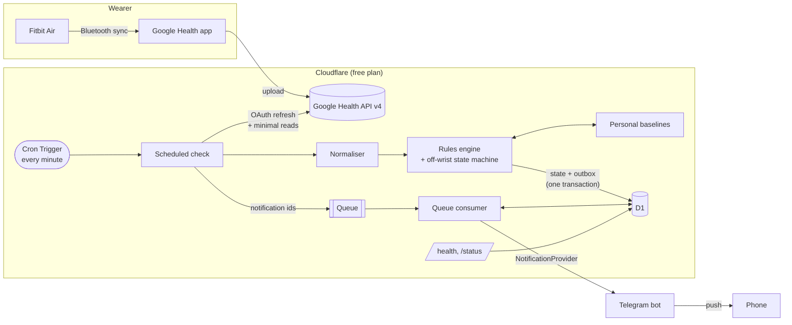
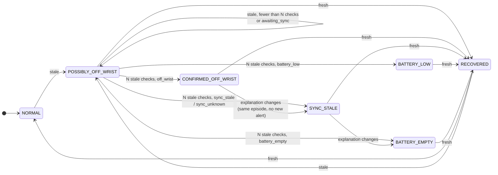
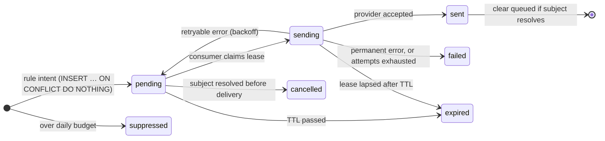
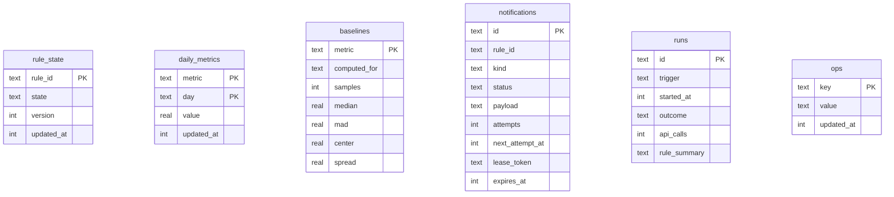

# PulseWatch architecture

This document explains how PulseWatch is put together and why. For setup see
[docs/SETUP.md](docs/SETUP.md); for what data is stored see
[docs/DATA.md](docs/DATA.md); for the threat model see [SECURITY.md](SECURITY.md).

- [System overview](#system-overview)
- [The scheduled checks](#the-scheduled-checks)
- [Off-wrist detection](#off-wrist-detection)
- [Rules engine](#rules-engine)
- [Personal baselines](#personal-baselines)
- [Notification delivery](#notification-delivery)
- [Storage](#storage)
- [Demo mode](#demo-mode)
- [Free-tier budget](#free-tier-budget)
- [Decisions and trade-offs](#decisions-and-trade-offs)

## System overview



One Worker has three entry points:

| Entry point | Trigger           | Job                                                                                         |
| ----------- | ----------------- | ------------------------------------------------------------------------------------------- |
| `scheduled` | Cron, `* * * * *` | Every 10th minute: fetch → normalise → evaluate → commit → dispatch; otherwise a wear check |
| `queue`     | Cloudflare Queues | Deliver notifications through the provider, with retries and idempotency                    |
| `fetch`     | HTTP              | `/health` (public), `/status` and `/admin/*` (bearer token)                                 |

Source layout:

```
src/
  index.ts              Worker entry points
  services.ts           wiring per invocation (live vs demo data source, provider)
  env.ts                bindings, variables and secrets, validated
  config/schema.ts      every rule threshold, with defaults (zod)
  domain/               internal types, time zone and formatting helpers
  google/               OAuth, API client, normaliser (the only code that knows Google's format)
  baseline/             statistics and personal baselines
  rules/                rule interface, engine, the seven rules
    off-wrist/          explicit state machine + rule
  pipeline/             the scheduled checks (full and wear) and the daily sync
  notifications/        provider interface, Telegram, ntfy, outbox, queue consumer, backoff
  storage/              D1 access: rule state, daily metrics, runs, ops, retention
  observability/        structured logging, /status
  demo/                 synthetic world, Google Health + ntfy emulators, scenarios
migrations/             D1 schema
scripts/                demo CLI, OAuth bootstrap, Telegram setup, secret generation (Node)
test/                   212 tests running inside workerd
```

## The scheduled checks

The cron fires every minute. Minutes 0, 10, 20 … run the **full check** shown
below. The other minutes run a **wear check**: the same pipeline restricted to
the off-wrist rule, without the daily sync or retention. It asks Google only
for the newest heart-rate sample time; the paired tracker (sync time, battery)
is fetched only once heart rate has gone quiet. So while the tracker is worn a
wear check costs one API call, and a removal is noticed within a minute of the
tracker syncing the gap. Google failures count towards the outage alert only
on full checks, and the access token is reused while the isolate stays warm.

```mermaid
sequenceDiagram
    autonumber
    participant Cron
    participant Check as Scheduled check
    participant D1
    participant Google as Google Health API
    participant Queue

    Cron->>Check: scheduled(scheduledTime)
    Check->>D1: INSERT run id "cron:<scheduledTime>" (lease)
    alt run id already present
        Check-->>Cron: duplicate delivery, skip
    end
    Check->>D1: load rule state + ops (2 queries)
    Note over Check: rules declare what they need; nothing else is fetched
    par only what enabled rules need
        Check->>Google: newest heart-rate sample time (1 item)
        Check->>Google: paired tracker (sync time, battery)
        Check->>Google: 5-min step + HR rollups (waking hours only)
    end
    opt daily sync due (backfill once, then until last night's data lands)
        Check->>Google: sleep, resting HR, HRV, respiratory rate, daily steps
        Check->>Check: recompute personal baselines
    end
    Check->>Check: evaluate rules (pure functions)
    Check->>D1: one batch: changed rule states, outbox rows, ops, run summary
    Check->>Queue: sendBatch({id}) for due outbox rows
    Check->>D1: mark enqueued
```

Properties that matter:

- **Exactly-once per cron slot.** The run row keyed by the scheduled time is
  the lease; a duplicate delivery of the same trigger does nothing.
- **Fetch only what is needed.** Each rule's `needs()` declares its data for
  this check. At night the inactivity rule needs nothing, so its two rollup
  calls are skipped; daily data is loaded only when a daily rule is due.
- **Field masks.** Every Google request carries a partial-response mask. The
  heart-rate query asks for the newest sample's _timestamp_ only; the device
  query never includes the MAC address.
- **Verified against the live API.** `POST /admin/diagnostics` checks each
  request the pipeline makes against production and returns structure only
  (statuses, counts, sizes): newest-first heart-rate ordering, roll-up
  windows on the requested grid with empty windows omitted, and a dry run of
  the 60-day first sync. It found two differences from the published schema
  that unit tests could not: `dailyRollUp` rejects any `pageSize`, and sleep
  pages hold 11–14 sessions rather than 25, so the backfill needs five pages.
  The emulator reproduces both, so the tests guard against regressions.
- **Failures are isolated.** Each data source is fetched independently. A
  failure makes that observation `unavailable`, and the rules that depend on
  it return `insufficient_data` and leave their state untouched.
- **One transaction.** Rule state, new outbox rows, resolutions and
  bookkeeping are committed in a single D1 batch, so a notification exists if
  and only if the state change that produced it was saved.
- **Writes only on change.** Rule state is compared with a key-order-stable
  serialisation; steady state (tracker worn, nothing happening) rewrites no
  rule rows.

## Off-wrist detection

### Why "no heart rate for 30 minutes" is not enough

Heart-rate data reaches Google only when the tracker syncs through the phone.
Measured against _now_, a 35-minute-old reading could mean the tracker is off
— or that the phone simply has not synced. PulseWatch reads the paired
tracker's `lastSyncTime` and battery through the `pairedDevices` endpoint and
reasons about the gap **before the last sync**:

```
            last heart rate            tracker synced         check
  ─────────────────●──────────────────────────●──────────────────●────▶
                   │◀──── gap before sync ────▶│
                   │       (evidence)          │◀─ sync age ─▶│
```

If the tracker synced at 14:36 and its newest heart rate is from 14:00, it was
demonstrably communicating while recording nothing on skin for 36 minutes.
That is strong evidence. If the newest heart rate is 13:59 and the last sync
was 14:00, nothing has been learned since: that is sync lag, not removal.

### Evidence classification (per check)

`classifyWear()` in [src/rules/off-wrist/machine.ts](src/rules/off-wrist/machine.ts):

| Situation                                                   | Evidence        |
| ----------------------------------------------------------- | --------------- |
| Heart-rate fetch failed                                     | `unavailable`   |
| Newest heart rate younger than 30 min                       | `fresh`         |
| Device info unavailable (e.g. settings scope not granted)   | `sync_unknown`  |
| Last-reported battery empty (status `EMPTY` or ≤ 5%)        | `battery_empty` |
| Tracker not synced for ≥ 60 min, last battery low (≤ 15%)   | `battery_low`   |
| Tracker not synced for ≥ 60 min                             | `sync_stale`    |
| Synced recently, heart-rate gap before that sync ≥ 30 min   | `off_wrist`     |
| Synced recently, but only shortly after the last heart rate | `awaiting_sync` |

Battery uses the level **as last reported**, even when sync is stale: a flat
tracker cannot sync, so requiring a recent sync (as an earlier draft did)
would misreport every dead battery as a sync problem.

### State machine



`nextWearState()` is a pure function; the full state × evidence table is
tested in [test/off-wrist-machine.test.ts](test/off-wrist-machine.test.ts).
Rules of the machine:

- **Confirmation.** `confirmationChecks` (default 2) consecutive stale checks
  are required. `awaiting_sync` counts as stale but never confirms on its own.
- **Unavailable data freezes the machine.** An API outage neither starts nor
  ends an episode.
- **Check spacing.** Stale checks closer than 5 minutes apart do not count, so
  a manual run or duplicate delivery cannot fast-forward confirmation.
- **One notification per episode**, sent on entering a confirmed state. The
  explanation may change later in the episode (e.g. the phone goes out of
  range) without a second alert.
- **Deferral.** Outside waking hours (default 07:00–23:00) the alert is held
  and sent on the first check after wake-up if the episode is still going.
- **Cooldown.** A new episode within 60 minutes of the last off-wrist alert
  waits for the cooldown instead of being dropped.
- **Recovery.** Fresh heart rate moves any episode to `RECOVERED`, records how
  long the tracker was off, and asks the notification layer to clear the phone
  notification (undelivered alerts are cancelled instead). No "welcome back"
  message is sent; the reminder disappearing is the signal.

Wording is hedged in proportion to the evidence — only `CONFIRMED_OFF_WRIST`
says "you may have forgotten to put it back on"; `SYNC_STALE` explicitly says
PulseWatch cannot tell whether it is being worn.

## Rules engine

A rule is a small, independently testable object ([src/rules/types.ts](src/rules/types.ts)):

```ts
interface HealthRule<Config, State> {
  id;
  name;
  description;
  severity;
  stateSchema; // zod schema for its persisted state
  initialState(): State;
  selectConfig(rules): Config; // its slice of PULSEWATCH_CONFIG
  needs(input): DataRequirement[]; // what this check must fetch
  evaluate(context): RuleOutcome; // pure: no I/O, clock or randomness
}

interface RuleOutcome<State> {
  state: State;
  status: 'ok' | 'pending' | 'alerting' | 'insufficient_data' | 'not_due' | 'disabled' | 'error';
  detail?: string; // short code for /status, never a value
  notifications?: NotificationIntent[];
  resolved?: string[]; // notification ids to cancel or clear
}
```

The engine ([src/rules/engine.ts](src/rules/engine.ts)) validates each rule's
stored state (falling back to the initial state on schema drift), isolates
exceptions per rule, and reports whether state changed. Rules never call a
provider: they return _intents_ with deterministic ids, and delivery is
someone else's problem.

| Rule               | Cadence           | Triggers when                                                     | Once per             |
| ------------------ | ----------------- | ----------------------------------------------------------------- | -------------------- |
| `deviceOffWrist`   | every check       | confirmed off-wrist / sync / battery episode                      | episode              |
| `inactivity`       | waking hours      | ≥ 90 min without a 5-min window of ≥ 100 steps, while worn        | still period         |
| `sleep`            | daily, after wake | last night's main sleep < target (6h 30m)                         | night                |
| `restingHeartRate` | daily             | 3 consecutive days above the personal range                       | episode (+ cooldown) |
| `hrv`              | daily             | 3 consecutive days below the personal range                       | episode (+ cooldown) |
| `morningBrief`     | 07:30–11:00       | last night's data is ready (or the 11:00 deadline passes)         | day                  |
| `serviceHealth`    | every check       | authorisation lost, or 6 consecutive checks without a Google sync | incident             |

The two trend rules come from one factory, `createTrendRule()`: adding a
respiratory-rate or SpO₂ trend is one more call with a metric, a transform and
thresholds.

Cross-cutting policies (waking hours, cooldowns) are helpers the rules call
while evaluating. That keeps deferral simple: a deferred alert is just an
episode whose `notifiedAt` is still `null`, retried on the next check.

A global safety valve caps alerts at 24 per rolling day; anything beyond is
stored as `suppressed` and counted, so a buggy rule cannot spam the phone.

## Personal baselines

"Unusual" means unusual **for this person, recently** — never a population
threshold. The method ([src/baseline/baseline.ts](src/baseline/baseline.ts)):

1. **Robust centre and spread.** Median, and the median absolute deviation
   scaled by 1.4826 (so it estimates σ for normal data). One night of alcohol,
   an illness or a sensor glitch can drag a mean and inflate a standard
   deviation; the median/MAD has a 50% breakdown point. Mean and SD are still
   computed and stored for reference.
2. **Log transform for HRV.** RMSSD is right-skewed and changes are
   multiplicative, so deviations are measured on `ln(HRV)`: a halving and a
   doubling are equally unusual, at any baseline level.
3. **Spread floor.** If someone's resting HR barely moves, the MAD can be
   ~0 and a 1 bpm change becomes a huge z-score. Floors (1 bpm; 0.05 log
   units ≈ 5% for HRV) keep scores meaningful.
4. **Statistical _and_ practical significance.** A day is unusual only if the
   robust z-score exceeds the threshold (2 for RHR, 1.5 for HRV) **and** the
   change is material (≥ 3 bpm; ≥ 15% for HRV).
5. **Persistence.** Trend alerts need N consecutive calendar days (default 3)
   on the same side. A missing day breaks the run — absence of data is never
   evidence.
6. **Guard window.** The baseline window (30 days) ends before the evaluated
   days, so a sustained change cannot absorb itself into its own reference.
7. **Minimum samples.** No baseline until 14 of the 30 days have data; rules
   report `baseline_building:n/14` instead of guessing.

Baselines are recomputed from stored daily aggregates only when new daily
data arrives (a handful of times each morning), never on the plain scheduled
path. Each computation is over ≤ 30 values.

This is descriptive statistics about personal history, not anomaly detection
in any clinical sense, and every message says so.

## Notification delivery



- **Transactional outbox.** Intents are rows in `notifications`, written with
  the rule state that produced them. The id is the rule's deterministic key,
  so the same event can never create two rows.
- **Queue carries ids only.** Messages are `{v:1, id}`. Notification text
  stays in D1 and is deleted (`payload = NULL`) as soon as the row reaches a
  terminal state.
- **Leases.** The consumer claims a row with a 60-second lease using a single
  conditional `UPDATE … RETURNING`. A duplicate or concurrent delivery sees
  the lease (retry later) or a terminal status (acknowledge) — never a second
  send. Completion updates are fenced by the lease token.
- **At-least-once.** If the Worker died after the provider accepted a
  message but before D1 recorded it, the retry would send again. With ntfy
  that is harmless (the same `sequence_id` _replaces_ the notification);
  Telegram has no idempotency key, so in that rare case a message can appear
  twice.
- **Retries.** Exponential backoff from 30 s (cap 30 min, ±20% jitter),
  honouring `Retry-After`; at most 5 attempts (configurable), then `failed`.
  Every alert has a TTL (off-wrist 3 h, inactivity 1 h, brief 4 h), so a
  delayed reminder is dropped rather than delivered stale. There is no path
  that retries forever.
- **Lost messages.** Each check re-enqueues due rows that have not been handed
  to the queue in 15 minutes. A retry pushes `enqueued_at` forward to its
  retry time, so re-dispatch does not duplicate scheduled retries.

### The ntfy.sh rate-limit problem

ntfy.sh's free tier allows 250 messages per day **per IP address**, and that
stays IP-based even with an account. Cloudflare Workers share egress IPs with
many other tenants, so a Worker can receive `429` with ntfy error code
`42908` ("daily message quota reached") having sent almost nothing itself
([binwiederhier/ntfy#1963](https://github.com/binwiederhier/ntfy/issues/1963),
[#1726](https://github.com/binwiederhier/ntfy/issues/1726)).

The first design treated this as expected rather than exceptional: 42908 is
classified separately from ordinary rate limiting and counted
(`notify.quota_exhausted_total` in `/status`), and its retries get a
15-minute floor in the hope of leaving through a different shared IP.

Production showed that is not enough. On the first full day PulseWatch
created 9 notifications and none arrived: 30 of 31 delivery attempts were
rejected with 42908 and one timed out. Retries at any spacing hit the same
exhausted quota, which resets only at midnight UTC. So the default provider
is now a **Telegram bot**: the Bot API has per-chat rate limits (honoured via
`retry_after`) but no per-IP daily quota. Because providers sit behind
`NotificationProvider`, the switch was one new class and a
`NOTIFY_PROVIDER` setting; ntfy stays available for a self-hosted server.
The trade-off is privacy: Telegram bot chats are not end-to-end encrypted,
so Telegram stores notification text until it is deleted.

## Storage



D1 is the only store. KV was considered and rejected: its free tier allows
1,000 writes/day and it is eventually consistent (up to ~60 s), which does
not suit leases, compare-and-swap rule state or deduplication. D1 gives
transactions (batches), conditional updates and SQL for retention. Details of
every table and its retention are in [docs/DATA.md](docs/DATA.md).

Multi-row writes (daily values, baselines, ops counters) are single
statements that expand a JSON array with `json_each`: D1 queries count
towards the free plan's 50-per-invocation limit, and a 60-day backfill is one
query instead of 420.

## Demo mode

Demo mode swaps the **network**, not the code. A deterministic synthetic
wearer ([src/demo/world.ts](src/demo/world.ts)) sits behind an HTTP emulator
of the Google Health API ([src/demo/google-emulator.ts](src/demo/google-emulator.ts))
that returns the real wire format — int64 values as strings, protobuf
durations, civil dates, extra fields the client does not ask for — rejects
malformed filters, paginates, and only reveals data recorded before the
tracker's last sync. A matching ntfy emulator can replay the real 42908 quota
rejection. Everything downstream — OAuth refresh, client, normaliser, rules,
D1, outbox, queue consumer, ntfy provider — is production code.

Three ways to run it:

| Command                     | Runtime                               | Clock                   |
| --------------------------- | ------------------------------------- | ----------------------- |
| `npm run demo`              | Node + real local D1 (Wrangler proxy) | simulated, 12 scenarios |
| `npm test` (scenarios file) | workerd + local D1                    | simulated               |
| `npm run dev` (MODE=demo)   | `wrangler dev`: workerd, D1, Queues   | real time               |

## Free-tier budget

Per day, for one person, at the defaults (estimates from the code paths;
measured production numbers are in the README):

| Resource              | Usage                                           | Free limit    |
| --------------------- | ----------------------------------------------- | ------------- |
| Worker invocations    | 1,440 cron + ~5–20 queue + a few HTTP           | 100,000       |
| CPU per invocation    | small: masked JSON, ≤ 30-value statistics       | 10 ms         |
| Subrequests per check | 3–5 steady state, ≤ 15 with a daily sync        | 50            |
| D1 queries per check  | ~8 typical, ~20 worst case                      | 50            |
| D1 rows written       | ~5 per check → ~7,200/day                       | 100,000       |
| D1 rows read          | ~50 per check → ~72,000/day                     | 5,000,000     |
| D1 storage            | < 1 MB (120 days × 7 metrics + short histories) | 5 GB          |
| Queue operations      | ~3 per notification → < 100/day                 | 10,000        |
| Cron triggers         | 1                                               | 5 per account |
| Telegram messages     | ~2–10                                           | No daily cap  |

## Decisions and trade-offs

| Decision                                                     | Why                                                                             | Trade-off                                                                     |
| ------------------------------------------------------------ | ------------------------------------------------------------------------------- | ----------------------------------------------------------------------------- |
| Refresh token as a Worker secret, obtained by a local CLI    | No credentials in D1, no public OAuth endpoints, no encryption-key management   | Re-authorising needs a laptop (rare once the OAuth app is "In production")    |
| Access tokens kept in memory only                            | Nothing reusable is ever persisted                                              | A token refresh per cold isolate or expired token (well within Google limits) |
| D1 only, no KV                                               | Consistency and transactions for leases, CAS and dedup; KV's 1k writes/day      | SQL to maintain                                                               |
| Outbox + Queue instead of calling the provider from the cron | Retries/backoff without blocking the check; durable across failures             | More moving parts than a direct `fetch`                                       |
| Queue messages carry ids, not content                        | Health text never sits in the queue; D1 stays the source of truth               | One extra D1 read per delivery                                                |
| Evidence = gap before last sync                              | Separates removal from sync lag                                                 | Needs the `settings.readonly` scope (degrades gracefully without it)          |
| One cron, local-time logic in code                           | Crons are UTC; DST handled once, in tested code                                 | Checks run every minute, even at night (a wear check is one API call)         |
| Robust statistics (median/MAD)                               | Wearable data is noisy and outlier-prone                                        | Less familiar than mean ± SD; documented here                                 |
| Hand-written `WorkerEnv` instead of generated env types      | Secrets exist at different stages; generated types would require them all       | Must be kept in sync with `wrangler.jsonc` by hand                            |
| No ML                                                        | A few months of one person's data do not justify a model; rules are explainable | Less adaptive; revisit once there is enough history                           |
