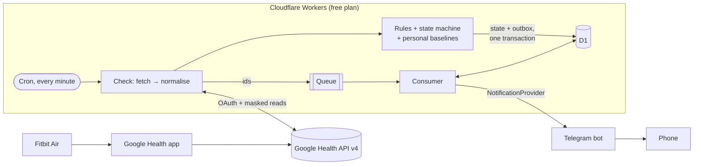
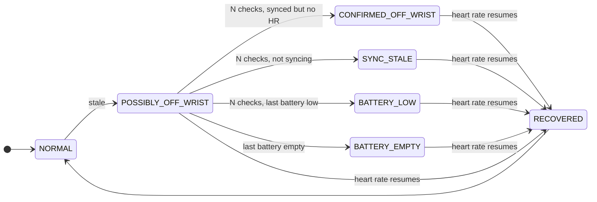

# PulseWatch

**Serverless wearable monitoring for the Fitbit Air.** PulseWatch reads the
Google Health API every minute from a Cloudflare Worker, reasons about
what the data means with an explicit state machine and personal baselines,
and sends push notifications to your phone through a Telegram bot — for
about £0 a month.

Website: [usmanmateen.github.io/pulsewatch](https://usmanmateen.github.io/pulsewatch/) ·
[Privacy policy](https://usmanmateen.github.io/pulsewatch/privacy/) ·
[Terms of service](https://usmanmateen.github.io/pulsewatch/terms/)

> [!IMPORTANT]
> PulseWatch is informational. It is **not a medical device** and is not
> intended for diagnosis, treatment or medical monitoring. "Unusual" always
> means unusual relative to _your own_ recent history.

- [1. Problem](#1-problem) · [2. Motivation](#2-motivation) · [3. Architecture](#3-architecture) · [4. Core features](#4-core-features)
- [5. Off-wrist state machine](#5-off-wrist-state-machine) · [6. Rules engine](#6-rules-engine) · [7. Personal baselines](#7-personal-baseline-methodology) · [8. Privacy and security](#8-privacy-and-security)
- [9. Demo mode](#9-demo-mode) · [10. Local development](#10-local-development) · [11. Testing](#11-testing) · [12. Deployment](#12-deployment) · [13. OAuth setup](#13-oauth-setup)
- [14. Limitations](#14-limitations) · [15. Cost](#15-cost) · [16. Roadmap](#16-future-roadmap)

## 1. Problem

I take my Fitbit Air off to shower and regularly forget to put it back on for
hours. My previous Whoop nudged me when the strap had been off too long;
Fitbit does not. A missing afternoon of data is annoying; a missing night of
sleep and recovery data is worse.

The naive fix — "no heart rate for 30 minutes → alert" — is wrong more often
than you would think. Heart-rate data only reaches Google when the tracker
syncs through the phone, so silence can mean _off the wrist_, _phone out of
range_, _app not syncing_ or _battery dead_. Telling those apart is the
interesting part.

## 2. Motivation

Beyond the reminder, I wanted a small, honest personal health-event platform:
rules that are independent and configurable, baselines built from my own
history rather than population thresholds, and delivery that survives the
realities of free-tier infrastructure. It had to be:

- **Unattended** — OAuth that keeps working for months, self-monitoring that
  says when it doesn't.
- **Private** — least data, least scope, least retention.
- **Free** — within Cloudflare's free plan and Telegram's free Bot API.
- **Demoable** — every feature can be shown with synthetic data, through the
  real pipeline, without exposing anyone's health information.

## 3. Architecture



- **Scheduled checks** (`* * * * *`): every tenth minute a full check
  refreshes an access token in memory, fetches only what enabled rules need
  (with field masks), normalises, evaluates rules, then commits state and
  notification intents to D1 in one batch. The minutes in between run a wear
  check: the off-wrist rule alone, one API call while the tracker is worn, so
  a removal is noticed within a minute of the tracker syncing.
- **Daily sync**: backfills 60 days once, then refreshes the last few days
  each morning until last night's sleep and recovery metrics land, and
  recomputes baselines.
- **Delivery**: a transactional outbox in D1, a Cloudflare Queue carrying
  only ids, and a consumer with leases, backoff and attempt limits.
- **HTTP**: public `/health`, token-protected `/status` and admin actions.

Deep dive, diagrams and trade-offs: **[ARCHITECTURE.md](ARCHITECTURE.md)**.

## 4. Core features

| Rule                         | What it does                                                                                                                  | Example                                                                                                                                                                        |
| ---------------------------- | ----------------------------------------------------------------------------------------------------------------------------- | ------------------------------------------------------------------------------------------------------------------------------------------------------------------------------ |
| **Off-wrist / missing data** | State machine using heart-rate recency, tracker sync time and battery; one alert per episode, cleared when you put it back on | ⌚ _No heart-rate data has been recorded for 41 minutes, even though your Fitbit Air synced 7 minutes ago. You may have forgotten to put it back on._                          |
| **Inactivity**               | ≥ 90 min without a 5-minute window of ≥ 100 steps, while worn and awake; cleared when you move                                | 🚶 _You've been mostly still for 1h 35m…_                                                                                                                                      |
| **Short sleep**              | Last night's main sleep below your target, with timing                                                                        | 😴 _Last night's recorded sleep was 4h 55m (23:16 → 04:50), below your 6h 30m target._                                                                                         |
| **Resting HR trend**         | 3 consecutive days outside your personal range (30-day robust baseline)                                                       | ❤️ _…above your usual range for 3 days (latest 64 bpm vs a 30-day median of 57 bpm)._                                                                                          |
| **HRV trend**                | 3 consecutive days of overnight HRV outside your range (log-scale baseline)                                                   | 📉 _…below your usual range for 3 days (latest 33 ms vs a 30-day median of 53 ms, −39%)._                                                                                      |
| **Morning brief**            | Once a day when last night's data is ready; missing metrics are omitted                                                       | ☀️ _Sleep: 7h 18m (23:16 → 07:13) · Resting HR: 58 bpm · HRV: 55 ms · Respiratory rate: 14.8 /min · Yesterday: 9,310 steps · No notable deviations from your recent baseline._ |
| **Service health**           | Tells you when PulseWatch itself can't work: lost authorisation, sustained Google outage                                      | ⚠️ _PulseWatch needs re-authorising…_                                                                                                                                          |

All examples above are real output from `npm run demo` (synthetic data).
Every threshold is configurable; alerts wait for waking hours; a daily budget
caps notifications if a rule ever misbehaves.

## 5. Off-wrist state machine



The key idea: measure the heart-rate gap **before the tracker's last sync**,
not before _now_.

```
       last heart rate               tracker synced        check
  ───────────●────────────────────────────●──────────────────●──▶
             │◀────── gap = evidence ────▶│◀── sync age ──▶│
```

If the tracker synced at 14:36 and its newest heart rate is from 14:00, it
was demonstrably communicating while recording nothing on skin: that is
evidence of removal. If it simply hasn't synced, PulseWatch says exactly that
("can't tell whether you're wearing it") instead of guessing, and a flat
battery is explained as a flat battery. Two consecutive stale checks are
required; an API outage freezes the state rather than inventing an episode;
one notification per episode; overnight alerts wait until morning; recovery
clears the phone notification.

## 6. Rules engine

Each rule is an independent object with its own config, validated state and a
**pure** `evaluate()` — no I/O, no clock, no randomness — so it is trivial to
test:

```ts
interface HealthRule<Config, State> {
  id;
  name;
  severity;
  stateSchema;
  initialState(); // persisted, validated per rule
  selectConfig(rules): Config; // its slice of PULSEWATCH_CONFIG
  needs(input): DataRequirement[]; // what this check must fetch
  evaluate(context): RuleOutcome<State>; // state, status, notification intents
}
```

Rules return _intents_ with deterministic ids; they never call a provider. The
engine isolates failures per rule and only persists state that changed. The
two trend rules share a factory, so adding an SpO₂ or respiratory-rate trend
is one call.

## 7. Personal baseline methodology

- **Median and MAD** (scaled ×1.4826) instead of mean and SD: wearable data
  has outliers — a night of alcohol, a cold, a sensor glitch — and the median
  barely moves when one of them lands.
- **Log scale for HRV**: RMSSD is right-skewed and changes multiplicatively,
  so −30% means the same thing at 35 ms and at 70 ms.
- **Spread floor**: stops an unusually stable history from turning a 1 bpm
  wobble into a "4σ event".
- **Statistical _and_ practical significance**: robust z ≥ 2 (HRV 1.5) _and_
  ≥ 3 bpm (HRV ≥ 15%).
- **Persistence**: 3 consecutive days on the same side; a missing day breaks
  the run.
- **Guard window + minimum samples**: the 30-day baseline excludes the days
  being judged, and nothing is claimed until 14 days of history exist.
- **Computed from daily aggregates, once a day** — never recomputed on the
  scheduled path.

This is descriptive statistics of your own history, not clinical anomaly
detection. Details: [ARCHITECTURE.md § Personal baselines](ARCHITECTURE.md#personal-baselines).

## 8. Privacy and security

- **Minimum scopes**: four read-only Google Health scopes.
- **Minimum data**: field masks mean heart-rate _values_ and MAC addresses
  are never downloaded; only daily aggregates are stored (120 days);
  notification text is deleted once delivered.
- **No credentials in the database**: the refresh token is a Cloudflare
  secret put there by `npm run oauth` via stdin; access tokens live in memory.
- **Sanitised observability**: structured logs of ids, states and codes only
  (tested); `/status` is token-protected and tested to contain no values.
- **Supply chain**: one runtime dependency (`zod`), `npm audit` in CI,
  Dependabot.

Threat model: **[SECURITY.md](SECURITY.md)**. Data inventory and retention:
**[docs/DATA.md](docs/DATA.md)**.

## 9. Demo mode

Demo mode swaps the network, not the code: a deterministic synthetic wearer
sits behind an HTTP emulator of the Google Health API (real wire format,
pagination, filter validation, sync lag) and of ntfy. OAuth, client,
normaliser, rules, D1, outbox, queue consumer and ntfy provider are all the
production code paths.

```bash
npm run demo                              # all 12 scenarios
npm run demo -- --list                    # list them
npm run demo -- wearable-removed-recovered inactivity
npm run demo -- --send                    # also push to the NTFY_TOPIC in .dev.vars, titled [DEMO]
```

Scenarios: normal day · wearable removed · removed then recovered · stale
device sync · low battery · empty battery · short sleep · unusual HRV trend
· higher resting-HR trend · extended inactivity · notification retry (ntfy
quota 429) · duplicate queue message.

```
━━ Wearable removed, then recovered ━━━━━━━━━━━━━━━━━━━━━━━━━━━━━━━━━━━━
Off for a shower at 14:00, back on at 15:05. The reminder is cleared on recovery.

 14:20  wear NORMAL
 14:30  wear POSSIBLY_OFF_WRIST
 14:40  wear CONFIRMED_OFF_WRIST
        📲 ⌚ Fitbit reminder [high]
           No heart-rate data has been recorded for 41 minutes, even though
           your Fitbit Air synced 7 minutes ago. You may have forgotten to
           put it back on.
 14:50  wear CONFIRMED_OFF_WRIST
 15:00  wear CONFIRMED_OFF_WRIST
 15:10  wear CONFIRMED_OFF_WRIST
 15:20  wear RECOVERED
        🧹 notification cleared from phone (deviceOffWrist-ep-1773153000000)
 15:30  wear NORMAL
```

For phone screenshots, subscribe to your topic and run `npm run demo --
--send`. With `MODE=demo` in `.dev.vars`, `npm run dev` runs the same
synthetic world in real time inside `wrangler dev` (cron, D1 and Queues
emulated locally).

## 10. Local development

```bash
npm ci
npm run secrets:init     # .dev.vars with MODE=demo and a status token (--new-topic adds an ntfy topic)
npm run dev              # wrangler dev with scheduled-event testing
curl "http://localhost:8787/__scheduled?cron=*+*+*+*+*"     # trigger a check
curl -H "Authorization: Bearer <STATUS_TOKEN>" http://localhost:8787/status
```

| Command                         | Purpose                                              |
| ------------------------------- | ---------------------------------------------------- |
| `npm run dev`                   | Local Worker (workerd, local D1 and Queues)          |
| `npm test`                      | All tests, inside workerd                            |
| `npm run typecheck`             | Worker, test and script TypeScript projects (strict) |
| `npm run lint` / `format:check` | ESLint (strict, type-aware) / Prettier               |
| `npm run check`                 | All of the above                                     |
| `npm run demo`                  | Synthetic scenarios through the real pipeline        |
| `npm run deploy`                | Checks, remote D1 migrations, deploy                 |

## 11. Testing

212 tests across 17 files run inside **workerd** (the production runtime)
with a real local D1 migrated from the production SQL, via
`@cloudflare/vitest-plugin`. They cover:

- the off-wrist state machine: every state × evidence transition,
  confirmation, check spacing, recovery, stale sync, battery, outages;
- baselines: statistics, rolling windows, robustness, log transform, spread
  floor, insufficient samples, sustained-deviation detection;
- every rule, including waking-hours deferral, cooldowns and resolution;
- the Google client and normaliser: int64-as-string, malformed and partial
  data, pagination loops, 401 refresh, retries, field-mask fallback;
- OAuth refresh (caching, concurrency, `invalid_grant`), PKCE;
- the Telegram and ntfy providers: request shape, escaping, rate limits
  (`retry_after`, ntfy quota 42908), permanent failures, clearing; backoff;
  provider selection and validation of Telegram credentials;
- configuration and settings: defaults, overrides, typos, out-of-range and
  contradictory values;
- local time: DST changes, windows that wrap midnight, parsing and formatting;
- the outbox and consumer on D1: deduplication, leases under concurrency,
  duplicate queue delivery, retry limits, TTL expiry, clearing;
- the pipeline: duplicate and concurrent cron runs, full checks every tenth
  minute and wear checks in between (one API call while worn), Google outage,
  auth circuit breaker, missing scope, notification budget, retention, the
  DST morning;
- service health: the Testing-mode token-expiry warning, waking hours and
  the overnight option;
- Google API diagnostics: request success and response structure, never
  values;
- HTTP: auth, security headers, no health values in `/status`;
- all 12 demo scenarios end to end, plus a test that no health values reach
  the logs; the live demo (`MODE=demo`) anchored at `DEMO_ANCHOR`.

## 12. Deployment

```bash
npx wrangler login
# D1 database + queue: create them, or put an existing database_id in wrangler.jsonc
npm run db:migrate:remote
npx wrangler deploy                        # Worker, cron, queue producer + consumer
npm run secrets:init -- --upload           # STATUS_TOKEN
npm run telegram:setup                     # bot token (hidden prompt) + chat id → Worker secrets
npm run oauth                              # Google consent → GOOGLE_REFRESH_TOKEN (+ client secret)
```

`GOOGLE_CLIENT_ID` and `NOTIFY_PROVIDER` are ordinary configuration in
`wrangler.jsonc`; the secrets are `GOOGLE_CLIENT_SECRET`, `GOOGLE_REFRESH_TOKEN`,
`STATUS_TOKEN`, `TELEGRAM_BOT_TOKEN` and `TELEGRAM_CHAT_ID` (or `NTFY_TOPIC` and
the optional `NTFY_TOKEN` with `NOTIFY_PROVIDER=ntfy`).

Full walkthrough, verification and operations: **[docs/SETUP.md](docs/SETUP.md)**.

## 13. OAuth setup

PulseWatch uses Google OAuth 2.0 (authorisation code + PKCE, `access_type=offline`)
through a one-off local CLI:

1. Google Cloud Console: enable **Google Health API**; configure the Google
   Auth Platform (External, add yourself as a test user, the four read-only
   scopes); create a **Web application** client whose only redirect URI is
   `http://localhost:8976/oauth/callback`.
2. Put the client ID in `wrangler.jsonc` (`GOOGLE_CLIENT_ID`), the client
   secret in `.env`, and run `npm run oauth`.
3. **Publish the app to "In production".** PulseWatch's own OAuth app is In
   production for personal use; it has not been through Google's formal
   verification, so consent shows an "unverified app" warning. (Apps left in
   _Testing_ get refresh tokens that expire after 7 days; for those, set
   `serviceHealth.refreshTokenLifetimeDays: 7` to get a reminder a day early.)

Production refresh tokens have no fixed lifetime, but they are not permanent:
they stop working if access is revoked, if unused for six months, or if more
than 100 are issued for the same account and client (Google then invalidates
the oldest). PulseWatch notices a rejected token and asks you to re-run
`npm run oauth`.

Why a local callback rather than a Worker route? The one-off consent runs on
your machine, so the refresh token goes straight from Google's token response
to `wrangler secret bulk` on stdin: it never crosses a public endpoint, never
lands in D1, and the Worker never needs a Cloudflare API credential to write
its own secrets. If Google later rejects it, PulseWatch stops calling the API,
sends one "re-authorise" notification, and resumes automatically once a new
token is stored. Step by step: [docs/SETUP.md § 3](docs/SETUP.md#3-google-cloud-oauth-client).

## 14. Limitations

- **Sync-dependent latency.** A removal is only visible once the tracker
  syncs its data to the phone and Google. Checks run every minute, so the
  reminder comes at the first check after a sync shows a long enough gap:
  about 40 minutes with the defaults (30 minutes, two checks), usually
  10–20 minutes with 5 minutes and one check.
- **Why Telegram, not public ntfy.sh.** ntfy.sh's free tier limits messages
  per IP, and Workers send from IPs shared with other Cloudflare customers.
  In production that quota was exhausted all day: on the first full day none
  of 9 notifications got through: 30 of 31 attempts were rejected with `429`
  (code 42908) and one timed out. ntfy remains available
  (`NOTIFY_PROVIDER=ntfy`) for a self-hosted server.
- **Telegram sees message text.** Bot chats are cloud chats, not end-to-end
  encrypted, so notification text (which can include sleep and heart-rate
  summaries) is stored by Telegram until deleted. Resolved off-wrist alerts
  are deleted automatically, and you can clear the chat at any time.
- **Naps in progress.** Sleep sessions appear only after Google processes
  them, so a long nap during waking hours can trigger the inactivity nudge.
- **One time zone.** Day boundaries and waking hours use `TIME_ZONE`; while
  travelling, set it to your current zone.
- **Single user.** One refresh token, one tracker (the most recently synced
  one if several are paired).
- **Google Health API is new.** Ordering, roll-up windows, field masks and
  pagination were verified against the live API with
  `POST /admin/diagnostics`. Where production differs from the published
  schema (`dailyRollUp` rejects `pageSize`; sleep pages come back shorter
  than requested), the client follows the observed behaviour. It still
  degrades gracefully if Google changes something, e.g. by retrying an
  endpoint without its field mask.
- **Not medical.** Thresholds are about personal history, not health
  outcomes.

## 15. Cost

**≈ £0/month** for one person on Cloudflare's free plan and Telegram's free Bot API.

| Resource                | Daily usage (estimate)                                | Free allowance              |
| ----------------------- | ----------------------------------------------------- | --------------------------- |
| Worker invocations      | ~1,460 (1,440 cron + queue + HTTP)                    | 100,000/day                 |
| Cron triggers           | 1                                                     | 5 per account               |
| Google Health API calls | ~1,500–3,000 (1–2 per wear check, 3–5 per full check) | 300/min per user            |
| D1 rows written / read  | ~7,200 / ~72,000                                      | 100,000 / 5,000,000 per day |
| D1 storage              | < 1 MB                                                | 5 GB                        |
| Queue operations        | < 100                                                 | 10,000/day                  |
| Telegram messages       | ~2–10                                                 | No daily cap (rate-limited) |

The derivation is in [ARCHITECTURE.md § Free-tier budget](ARCHITECTURE.md#free-tier-budget).

## 16. Future roadmap

Designed for, not built yet:

- **More trends** through `createTrendRule()`: SpO₂, respiratory rate, skin
  temperature, VO₂ max.
- **Weekly report** and workout/recovery relationships.
- **More providers** behind `NotificationProvider` (Telegram and ntfy exist):
  email, web push, WhatsApp.
- **More sources**: Health Connect / Apple Health or other wearables behind
  the normaliser boundary.
- **Multiple users**: per-user rows keyed by the Google Health user id.
- **Dashboard** on top of `/status` and daily aggregates.
- **User-configurable rules** from the existing config schema.
- **Charging detection** (battery rising while off-wrist) for a "fully
  charged — put it back on" reminder.
- **Smarter anomaly detection** once there are months of history — kept out
  of V1 on purpose.

## Project facts

|                                |                                                                                                                                                    |
| ------------------------------ | -------------------------------------------------------------------------------------------------------------------------------------------------- |
| Rules                          | 7 (6 health rules + self-monitoring)                                                                                                               |
| Off-wrist state-machine states | 7                                                                                                                                                  |
| Automated tests                | 212 (17 files, in workerd)                                                                                                                         |
| Demo scenarios                 | 12                                                                                                                                                 |
| Health signals used            | heart-rate presence, tracker sync time and battery, 5-minute and daily steps, sleep duration and timing, resting HR, HRV (RMSSD), respiratory rate |
| Cloud services                 | Cloudflare Workers, Cron Triggers, D1, Queues, Workers Logs; Google Health API; Telegram Bot API; ntfy                                             |
| Runtime dependencies           | 1 (`zod`)                                                                                                                                          |
| Worker bundle                  | 196 KiB (62 KiB gzip)                                                                                                                              |
| Monthly cost                   | ≈ £0                                                                                                                                               |

## License

[MIT](LICENSE)
